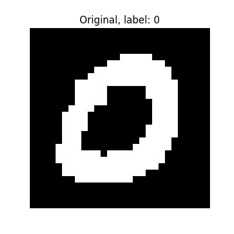
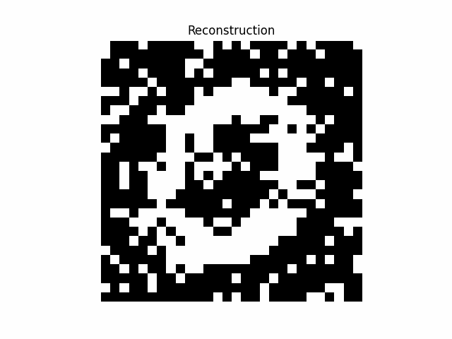
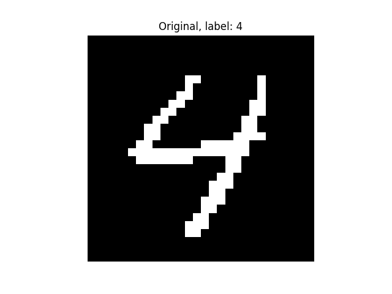
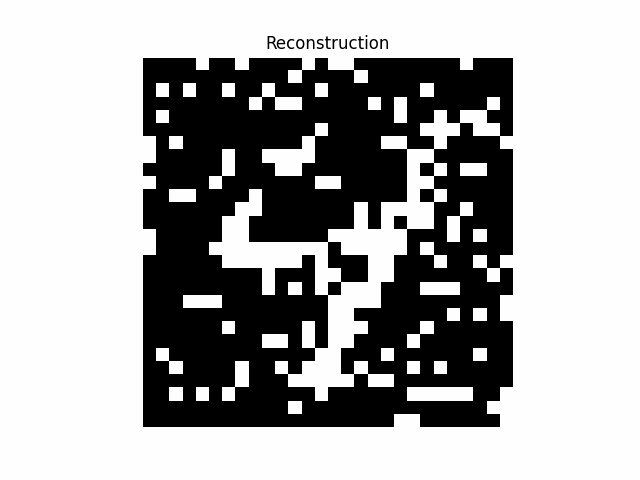

# hopfield-net
Implementation of a hopfield network, with MNIST digit reconstruction.

Will need the `Pillow` writer

```bash
pip3 install pillow
```

<div style="display: flex; align-items: center; justify-content: space-between; margin-bottom: 20px;">
  
  
</div>

<div style="display: flex; align-items: center; justify-content: space-between; margin-bottom: 20px;">
  
  
</div>

#### Resources:

- Some nice resources [here](https://perso.ens-lyon.fr/eric.thierry/Graphes2010/alice-julien-laferriere.pdf) and [here](http://therisingsea.org/notes/deeprl-seminar-lecture3.pdf).